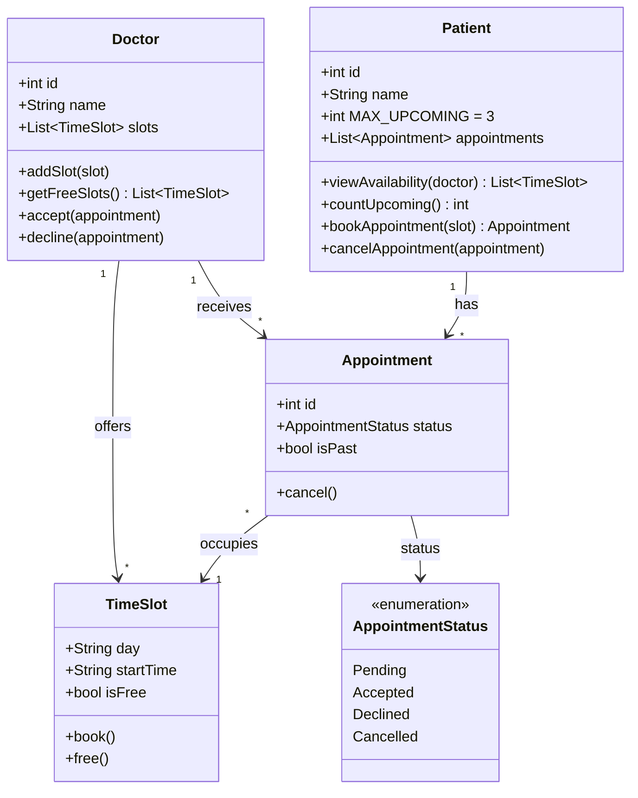

# Class Diagram

```mermaid
classDiagram
    class AppointmentStatus {
        <<enumeration>>
        Pending
        Accepted
        Declined
        Cancelled
    }

    class Doctor {
        +int id
        +String name
        +List~TimeSlot~ slots
        +addSlot(slot)
        +getFreeSlots() List~TimeSlot~
        +accept(appointment)
        +decline(appointment)
    }

    class TimeSlot {
        +String day
        +String startTime
        +bool isFree
        +book()
        +free()
    }

    class Appointment {
        +int id
        +AppointmentStatus status
        +bool isPast
        +cancel()
    }

    class Patient {
        +int id
        +String name
        +int MAX_UPCOMING = 3
        +List~Appointment~ appointments
        +viewAvailability(doctor) List~TimeSlot~
        +countUpcoming() int
        +bookAppointment(slot) Appointment
        +cancelAppointment(appointment)
    }

    Doctor "1" --> "*" TimeSlot : offers
    Patient "1" --> "*" Appointment : has
    Doctor "1" --> "*" Appointment : receives
    Appointment "*" --> "1" TimeSlot : occupies
    Appointment --> AppointmentStatus : status
```
