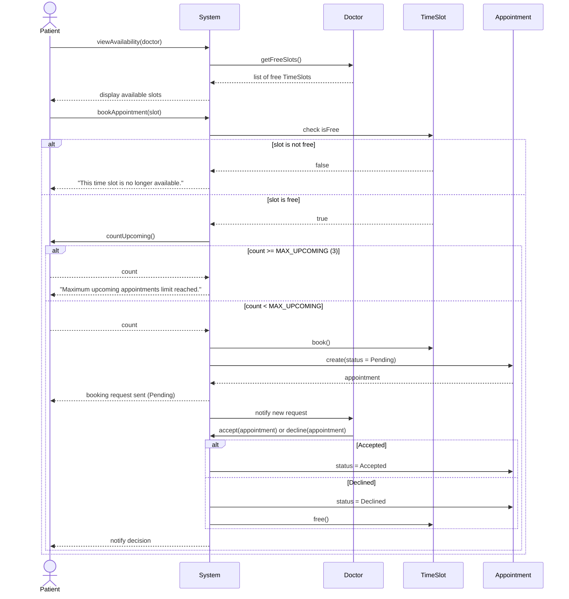

# Sequence Diagram

```mermaid
sequenceDiagram
    actor P as Patient
    participant S as System
    participant D as Doctor
    participant T as TimeSlot
    participant A as Appointment

    P->>S: viewAvailability(doctor)
    S->>D: getFreeSlots()
    D-->>S: list of free TimeSlots
    S-->>P: display available slots

    P->>S: bookAppointment(slot)
    S->>T: check isFree
    alt slot is not free
        T-->>S: false
        S-->>P: "This time slot is no longer available."
    else slot is free
        T-->>S: true
        S->>P: countUpcoming()
        alt count >= MAX_UPCOMING (3)
            P-->>S: count
            S-->>P: "Maximum upcoming appointments limit reached."
        else count < MAX_UPCOMING
            P-->>S: count
            S->>T: book()
            S->>A: create(status = Pending)
            A-->>S: appointment
            S-->>P: booking request sent (Pending)
            S->>D: notify new request
            D->>S: accept(appointment) or decline(appointment)
            alt Accepted
                S->>A: status = Accepted
            else Declined
                S->>A: status = Declined
                S->>T: free()
            end
            S-->>P: notify decision
        end
    end
```
