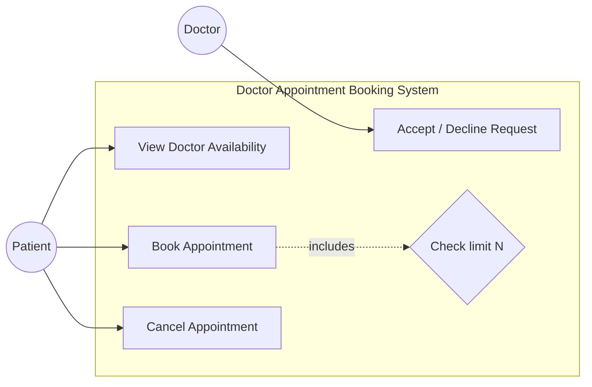

# Use Case Diagram

```mermaid
flowchart LR
    Patient((Patient))
    Doctor((Doctor))

    subgraph System[Doctor Appointment Booking System]
        UC1[View Doctor Availability]
        UC2[Book Appointment]
        UC3[Accept / Decline Request]
        UC4[Cancel Appointment]
        CheckN{Check limit N}
    end

    Patient --> UC1
    Patient --> UC2
    Patient --> UC4
    Doctor --> UC3
    UC2 -.->|includes| CheckN
```